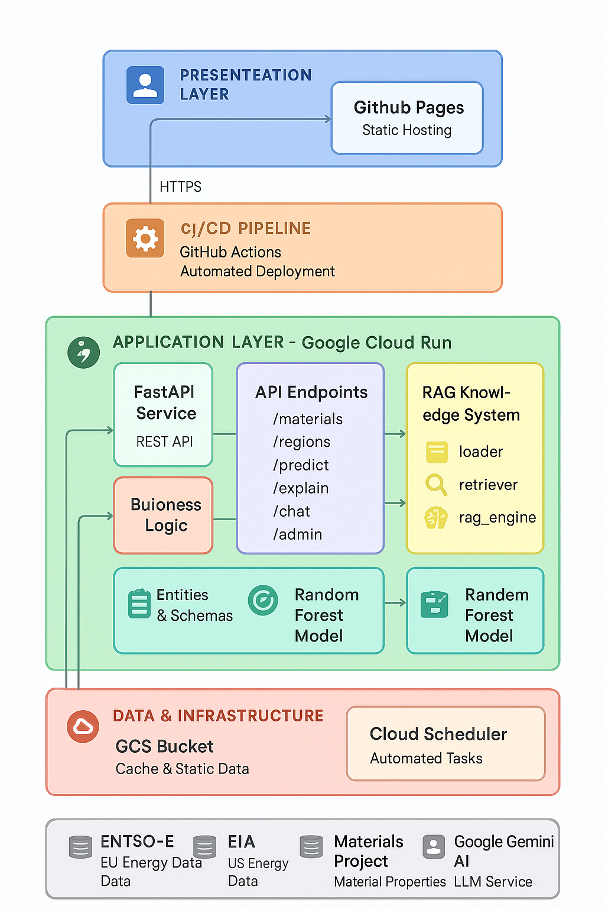

# Smart TCO Calculator

**Total Cost of Ownership Calculator for Semiconductor Materials**

[](https://github.com/martamateu/smart-tco-calculator/actions/workflows/deploy.yml)

Real-time TCO analysis for semiconductor manufacturing across 27 materials and 18 global regions with automated price updates and AI-powered insights.

🌐 **Live Demo:** [https://martamateu.github.io/smart-tco-calculator/](https://martamateu.github.io/smart-tco-calculator/)

🌍 **Languages:** English, Spanish, Catalan (automatic routing with /en, /es, /cat)

> 🔍 **Important:** This calculator analyzes **Total Cost of Ownership for chip procurement** (not Transparent Conductive Oxides). See [TCO Disambiguation Guide](backend/data/TCO_DISAMBIGUATION.md) for clarification.

## ✨ Key Features

- 🌍 **27 Semiconductor Materials**: Si, Ge, SiC, GaN, GaAs, Diamond, and more
- 🗺️ **18 Global Regions**: EU countries, USA states, Asia-Pacific, Latin America
- ⚡ **Real-time Energy Prices**: Auto-updated every 8 hours (EU) and daily (USA)
- 🤖 **AI-Powered Insights**: Gemini-powered explanations and interactive Q&A chatbot
- 📊 **Advanced Visualizations**: Waterfall charts, scenario comparisons, sensitivity analysis
- 🌐 **Multilingual**: Full support for English, Spanish, and Catalan
- 🔐 **Secure Architecture**: Cloud Run backend with Secret Manager integration
- 📱 **Responsive Design**: Works seamlessly on desktop, tablet, and mobile
- 🎨 **Modern UI**: Tailwind CSS with collapsible sections and smooth animations
- 📈 **ML-Powered Predictions**: Random Forest model for TCO forecasting

## 📚 Documentation

| Document | Description |
|----------|-------------|
| [TCO_DISAMBIGUATION.md](backend/data/TCO_DISAMBIGUATION.md) | **Clarifies the two different TCO concepts** in semiconductors (material vs economic) |
| [TCO_FORMULAS.md](backend/data/TCO_FORMULAS.md) | Detailed mathematical formulas and SEMI E35 mapping |
| [MANUAL_DATA_SOURCES.md](backend/data/MANUAL_DATA_SOURCES.md) |  **Manual data sources & update guidelines** (chip costs, energy consumption, carbon footprint) |
| [TABLES_DOCUMENTATION.md](backend/data/TABLES_DOCUMENTATION.md) | Data schema and table structures |
| [VERIFICATION_REPORT.md](VERIFICATION_REPORT.md) | Calculation accuracy audit and test results |

### Data Source Details
- [CHIP_COST_SOURCES.md](backend/data/CHIP_COST_SOURCES.md) - IC Insights, Yole, TechInsights pricing data
- [CARBON_FOOTPRINT_SOURCES.md](backend/data/CARBON_FOOTPRINT_SOURCES.md) - GlobalFoundries, Yole LCA studies
- [SUBSIDY_SOURCES.md](backend/data/SUBSIDY_SOURCES.md) - EU Chips Act, US CHIPS Act, national programs

---

## 📊 Data Sources & Update Frequency

### ✅ Live Data (Auto-Updated)

| Data Type | Source | Update Frequency | Regions | API Status |
|-----------|--------|------------------|---------|------------|
| **EU Energy Prices** | [ENTSO-E Transparency Platform](https://transparency.entsoe.eu/) | Every 8 hours | 19 EU countries | ✅ Active |
| **USA Energy Prices** | [EIA Open Data](https://www.eia.gov/opendata/) | Daily at 6 AM EST | 5 states (CA, TX, AZ, OH, NY) | ✅ Active |
| **Material Properties** | [Materials Project REST API](https://materialsproject.org/) | Quarterly (Jan/Apr/Jul/Oct) | 27 semiconductors | ✅ Active |

**EU Regions (ENTSO-E):** Austria, Belgium, Bulgaria, Croatia, Czech Republic, Denmark, Estonia, Finland, France, Germany, Greece, Hungary, Ireland, Italy, Netherlands, Poland, Portugal, Spain, United Kingdom

**USA Regions (EIA):** California, Texas, Arizona, Ohio, New York

**Materials (Properties from Materials Project):**
- Traditional: Si, Ge
- Wide-bandgap: SiC  
- Ultra-wide: C (Diamond)
- III-V Compounds: GaAs, GaP, GaSb, InP, InAs, InSb, AlP, AlAs, AlSb
- III-Nitrides: GaN, AlN, InN
- II-VI Compounds: ZnO, ZnS, ZnSe, ZnTe, CdS, CdSe, CdTe
- 2D Materials: MoS₂, WS₂, WSe₂, MoSe₂

### 📁 Static Data (Manual Updates)

| Data Type | Source | Update Method | Last Updated | Status |
|-----------|--------|---------------|--------------|--------|
| **Chip Costs** | IC Insights, Yole, TechInsights | Manual quarterly | 2024 Q4 | ✅ Verified |
| **Energy Consumption** | JRC, Industry benchmarks | Manual quarterly | 2025 Q1 | ✅ Verified |
| **Subsidies** | EU Chips Act, USA CHIPS Act, national programs | Manual annually | 2025 Jan | ✅ Verified |
| **Carbon Footprint** | GlobalFoundries, Yole LCA, academic studies | Manual annually | 2024 Q4 | ✅ Verified |
| **TRL Levels** | Industry maturity analysis | Manual annually | 2025 | ✅ Verified |

**Why Static?**
- No public APIs available for semiconductor pricing or government subsidy programs
- Data changes infrequently (quarterly/annually)
- Requires manual verification from official sources
- All data sources fully documented in [MANUAL_DATA_SOURCES.md](backend/data/MANUAL_DATA_SOURCES.md)

---

## 🏗️ Architecture


*Comprehensive system architecture showing all layers and components*

### System Overview

```
┌─────────────────────────────────────────────────────────────┐
│                    PRESENTATION LAYER                        │
│                                                              │
│  ┌──────────────────────────────────────────────────────┐  │
│  │           GitHub Pages - Static Hosting              │  │
│  │  React + TypeScript + Vite + i18n (EN/ES/CAT)       │  │
│  └──────────────────────────────────────────────────────┘  │
└────────────────────────┬─────────────────────────────────────┘
                         │ HTTPS
┌────────────────────────┴─────────────────────────────────────┐
│                   CI/CD PIPELINE                             │
│              GitHub Actions - Automated Deployment           │
└────────────────────────┬─────────────────────────────────────┘
                         │
┌────────────────────────┴─────────────────────────────────────┐
│           APPLICATION LAYER - Google Cloud Run               │
│                                                              │
│  ┌──────────────┐  ┌──────────────────────────────────────┐│
│  │   FastAPI    │  │      API Endpoints                   ││
│  │   Service    │──│  /materials  /regions  /predict      ││
│  │   REST API   │  │  /explain    /chat     /admin        ││
│  └──────────────┘  └──────────────────────────────────────┘│
│         │                                                    │
│  ┌──────┴──────┐                                            │
│  │  Business   │   ┌─────────────────────────────────────┐ │
│  │   Logic     │───│     RAG Knowledge System            │ │
│  └─────────────┘   │  - loader (PDF documents)          │ │
│                    │  - retriever (semantic search)      │ │
│                    │  - rag_engine (LLM + context)       │ │
│                    └─────────────────────────────────────┘ │
│                                                              │
│  ┌──────────────────────────────────┐  ┌─────────────────┐│
│  │   Entities & Schemas             │  │  Random Forest  ││
│  │   (Pydantic models)              │──│     Model       ││
│  └──────────────────────────────────┘  │  (ML inference) ││
│                                         └─────────────────┘│
└────────────────────────┬─────────────────────────────────────┘
                         │
┌────────────────────────┴─────────────────────────────────────┐
│              DATA & INFRASTRUCTURE                           │
│                                                              │
│  ┌─────────────────────────────┐  ┌─────────────────────┐  │
│  │      GCS Bucket             │  │  Cloud Scheduler    │  │
│  │  Cache & Static Data        │  │  Automated Tasks    │  │
│  │  - energy_prices_live.json  │  │  - ENTSO-E (8h)    │  │
│  │  - eia_prices_cache.json    │  │  - EIA (daily)     │  │
│  │  - semiconductors_*.json    │  │  - Materials (Q)   │  │
│  └─────────────────────────────┘  └─────────────────────┘  │
└──────────────────────────────────────────────────────────────┘
         │              │              │              │
┌────────┴──────┐  ┌────┴─────┐  ┌────┴──────┐  ┌────┴──────┐
│   ENTSO-E     │  │   EIA    │  │ Materials │  │  Gemini   │
│ EU Energy Data│  │ US Energy│  │  Project  │  │    AI     │
└───────────────┘  └──────────┘  └───────────┘  │LLM Service│
                                                 └───────────┘
```

### Key Components

**Presentation Layer:**
- Static React app hosted on GitHub Pages
- Multi-language support (EN/ES/CAT)
- Responsive design for mobile/desktop

**Application Layer:**
- **FastAPI Service**: Python REST API on Cloud Run
- **Business Logic**: TCO calculations, price updates, data validation
- **RAG System**: PDF document loader + semantic search + LLM-powered explanations
- **ML Model**: Random Forest for TCO predictions

**Data Layer:**
- **GCS Bucket**: Persistent storage for caches and static data
- **Cloud Scheduler**: Automated data refresh (OIDC authenticated)

**External APIs:**
- ENTSO-E: Day-ahead electricity prices (19 EU countries)
- EIA: Retail electricity prices (5 US states)
- Materials Project: Semiconductor material properties (27 materials)
- Google Gemini: AI explanations and chat

### Backend (FastAPI + Cloud Run)
- **Hosting:** Google Cloud Run (europe-west1)
- **URL:** https://smart-tco-backend-859997094469.europe-west1.run.app
- **Storage:** Cloud Storage (`tco-calculator-cache`) for persistent data
- **Schedulers:** Cloud Scheduler with OIDC authentication
  - `refresh-entsoe-prices`: Every 8 hours (Europe/Madrid)
  - `refresh-eia-prices`: Daily at 6 AM (America/New_York)
  - `refresh-materials-project`: Quarterly - 1st of Jan/Apr/Jul/Oct at 3 AM (Europe/Madrid)

### Frontend (React + GitHub Pages)
- **Hosting:** GitHub Pages
- **URL:** https://martamateu.github.io/smart-tco-calculator/
- **CI/CD:** GitHub Actions auto-deploy on push to main
- **Languages:** English, Spanish, Catalan

### Data Pipeline
```
┌─────────────────┐
│  External APIs  │
│  ENTSO-E / EIA  │
│  Materials Proj │
└────────┬────────┘
         │ Cloud Schedulers
         ▼
┌─────────────────┐
│  Cloud Run      │
│  FastAPI Backend│
└────────┬────────┘
         │ Upload
         ▼
┌─────────────────┐
│  Cloud Storage  │
│  GCS Bucket     │
│  (Persistent)   │
└────────┬────────┘
         │ Load on startup
         ▼
┌─────────────────┐
│  API Endpoints  │
│  /api/regions   │
│  /api/materials │
└─────────────────┘
```

---

## 🚀 Quick Start

### Prerequisites
- Node.js ≥18
- Python ≥3.10
- Google Cloud SDK (for deployment)

### Local Development

#### Backend
```bash
cd backend
python -m venv venv
source venv/bin/activate  # Windows: venv\Scripts\activate
pip install -r requirements.txt

# Set environment variables (create .env file)
cp .env.example .env
# Add your API keys: ENTSOE_API_KEY, EIA_API_KEY, MATERIALS_PROJECT_API_KEY

# Run server
uvicorn main:app --reload --port 8000
# API docs: http://localhost:8000/docs
```

#### Frontend
```bash
npm install
npm run dev
# Open http://localhost:5173
```

---

## 📡 API Endpoints

### Public Endpoints

| Endpoint | Method | Description |
|----------|--------|-------------|
| `/` | GET | API root with metadata |
| `/health` | GET | Server health check |
| `/health/ready` | GET | Readiness check (data loaded) |
| `/api/materials` | GET | 27 semiconductor materials |
| `/api/regions` | GET | 18 regions with live energy prices |
| `/api/scenarios` | POST | TCO scenario comparison |
| `/api/predict` | POST | Calculate TCO for inputs |
| `/api/explain` | POST | AI explanation (Gemini) |
| `/api/chat` | POST | Q&A chatbot (RAG + Gemini) |
| `/api/admin/status` | GET | System status (cache age, materials DB) |
| `/api/admin/cache-status` | GET | Detailed cache debugging info |

### Admin Endpoints (Require Auth)

| Endpoint | Method | Description | Trigger |
|----------|--------|-------------|---------|
| `/api/admin/refresh-prices/entsoe` | POST | Update EU energy prices | Cloud Scheduler (8h) |
| `/api/admin/refresh-prices/eia` | POST | Update USA energy prices | Cloud Scheduler (daily) |
| `/api/admin/refresh-prices/materials-project` | POST | Update material properties | Cloud Scheduler (monthly) |
| `/api/admin/retrain-model` | POST | Retrain ML model | Manual |
| `/api/admin/audit` | POST | Run data quality audit | Manual |

**Authentication:** OIDC tokens (Cloud Scheduler) or Admin API Key

**Full API documentation:** [https://smart-tco-backend-859997094469.europe-west1.run.app/docs](https://smart-tco-backend-859997094469.europe-west1.run.app/docs)

---

## 🔧 Environment Variables

### Backend (.env)
```bash
# APIs
ENTSOE_API_KEY=your_entsoe_key          # Get from https://transparency.entsoe.eu/
EIA_API_KEY=your_eia_key                # Get from https://www.eia.gov/opendata/
MATERIALS_PROJECT_API_KEY=your_mp_key   # Get from https://materialsproject.org/
GEMINI_API_KEY=your_gemini_key          # Get from Google AI Studio

# Admin
ADMIN_API_KEY=your_admin_key            # For manual scheduler triggers

# GCP
GOOGLE_CLOUD_PROJECT=your-project-id
GCS_BUCKET_NAME=your-bucket-name

# Optional
USE_EMBEDDINGS=true                     # Enable RAG knowledge base
GEMINI_MODEL=gemini-2.5-flash          # AI model version
```

---

## 🌍 Deployment

### Backend (Cloud Run)

```bash
cd backend

# Deploy with secrets (recommended)
gcloud run deploy smart-tco-backend \
  --source . \
  --platform managed \
  --region europe-west1 \
  --project your-project-id \
  --memory 2Gi \
  --cpu 2 \
  --timeout 120s \
  --allow-unauthenticated \
  --set-secrets="ENTSOE_API_KEY=entsoe-api-key:latest,EIA_API_KEY=eia-api-key:latest,ADMIN_API_KEY=admin-api-key:latest,GEMINI_API_KEY=gemini-api-key:latest,MATERIALS_PROJECT_API_KEY=MATERIALS_PROJECT_API_KEY:latest"

# Setup automated price updates
./setup_cloud_schedulers.sh
./setup_materials_scheduler.sh
```

**Important:** Never expose API keys in frontend! All credentials are managed through Google Secret Manager and Cloud Run secrets.

### Frontend (GitHub Pages)

Automatic deployment on push to main via GitHub Actions (`.github/workflows/deploy.yml`)

Manual deployment:
```bash
npm run build
npm run deploy
```

---

## 📦 Project Structure

```
smart-tco-calculator/
├── backend/
│   ├── main.py                      # FastAPI app entry point
│   ├── requirements.txt             # Python dependencies
│   ├── Dockerfile                   # Container build
│   ├── app.yaml                     # Cloud Run config
│   ├── routers/
│   │   ├── admin.py                 # Admin/scheduler endpoints
│   │   ├── tco.py                   # TCO calculation endpoints
│   │   └── rag.py                   # AI/RAG endpoints
│   ├── services/
│   │   ├── data_access.py           # Material/region catalog
│   │   ├── tco_calculator.py        # TCO calculation logic
│   │   └── rag_service.py           # RAG knowledge engine
│   ├── utils/
│   │   ├── fetch_energy_prices.py   # ENTSO-E API client
│   │   ├── fetch_eia_prices.py      # EIA API client
│   │   ├── fetch_materials_project.py # Materials Project client
│   │   ├── gcs_cache.py             # Cloud Storage operations
│   │   └── data_audit.py            # Data quality checks
│   ├── data/
│   │   ├── semiconductors_comprehensive.json  # 27 materials
│   │   ├── global_electricity_data_2025.json  # Subsidies/carbon
│   │   ├── TCO_FORMULAS.md          # Detailed formula documentation
│   │   ├── TCO_DISAMBIGUATION.md    # TCO concept clarification ⚠️
│   │   └── *.pdf                    # RAG knowledge base docs
│   └── models/
│       └── tco_random_forest.pkl    # Trained ML model
├── components/
│   ├── InputForm.tsx                # Material/region selection + integrated chat
│   ├── ChatSection.tsx              # AI Q&A chatbot (integrated in form)
│   ├── ResultsCard.tsx              # TCO results with collapsible waterfall
│   ├── ExplanationPanel.tsx         # AI insights with accordion sections
│   ├── ScenarioChart.tsx            # Scenario comparison charts
│   ├── EnhancedScenarioChart.tsx    # Advanced scenario visualizations
│   ├── MaterialComparison.tsx       # Material recommendations dashboard
│   ├── SensitivityAnalysis.tsx      # Sensitivity analysis dashboard
│   ├── RegionalPriceComparison.tsx  # Regional energy price comparison
│   ├── RandomForestVisualization.tsx # ML model visualization
│   ├── RAGVisualization.tsx         # RAG system visualization
│   ├── NavBar.tsx                   # Navigation + language switcher
│   ├── DocsPage.tsx                 # Documentation page
│   ├── AboutPage.tsx                # About page
│   └── CitationsPage.tsx            # Data sources and citations
├── contexts/
│   └── LanguageContext.tsx          # i18n state management
├── locales/
│   ├── en.ts                        # English translations
│   ├── es.ts                        # Spanish translations
│   └── cat.ts                       # Catalan translations
├── services/
│   └── api.ts                       # Frontend API client
├── types.ts                         # TypeScript interfaces
├── App.tsx                          # React app root
└── README.md                        # This file
```

---

## 🧪 Testing

### Backend
```bash
cd backend
pytest tests/
```

### Frontend
```bash
npm test
```

### Manual API Testing
```bash
# Test health
curl https://smart-tco-backend-859997094469.europe-west1.run.app/health

# Test materials
curl https://smart-tco-backend-859997094469.europe-west1.run.app/api/materials

# Test cache status
curl https://smart-tco-backend-859997094469.europe-west1.run.app/api/admin/cache-status

# Trigger manual update (requires API key)
curl -X POST \
  https://smart-tco-backend-859997094469.europe-west1.run.app/api/admin/refresh-prices/entsoe \
  -H "X-API-Key: your-admin-key"
```

---

## 📊 Monitoring

### Cache Status
```bash
# Check cache age and status
curl https://smart-tco-backend-859997094469.europe-west1.run.app/api/admin/cache-status
```

### Cloud Scheduler Logs
```bash
gcloud logging read 'resource.type=cloud_scheduler_job' \
  --limit=20 \
  --project=calcium-land-466213-e0
```

### Cloud Run Logs
```bash
gcloud logging read 'resource.type=cloud_run_revision' \
  --limit=50 \
  --project=calcium-land-466213-e0
```

---

## 🔐 Security

- **No API Keys in Frontend:** All API keys stored securely in backend only (removed from vite.config.ts)
- **Secret Manager Integration:** All sensitive credentials stored in Google Secret Manager
- **OIDC Authentication:** Cloud Schedulers use service account OIDC tokens (no API keys in config)
- **CORS Protection:** Configured for GitHub Pages origin only
- **Rate Limiting:** Implemented on all public endpoints
- **Admin Endpoints:** Protected with Admin API Key + OIDC tokens
- **Secure Communication:** All API calls proxied through backend to hide credentials

---

## 🤝 Contributing

1. Fork the repository
2. Create a feature branch (`git checkout -b feature/amazing-feature`)
3. Commit changes (`git commit -m '✨ Add amazing feature'`)
4. Push to branch (`git push origin feature/amazing-feature`)
5. Open a Pull Request

**Code Style:**
- Backend: PEP 8 (Python), type hints required
- Frontend: ESLint + Prettier (React/TypeScript)
- Commits: [Conventional Commits](https://www.conventionalcommits.org/)

---

## 📄 License

This project is licensed under the MIT License - see the LICENSE file for details.

---

## 👥 Authors

- **Marta Mateu** - *Initial work* - [martamateu](https://github.com/martamateu)

---

## 🙏 Acknowledgments

- **ENTSO-E** for European energy price data
- **EIA** for USA energy price data
- **Materials Project** for semiconductor material properties
- **Google Gemini** for AI-powered explanations
- **EU Chips Act & USA CHIPS Act** for subsidy data

---

## 📞 Support

For questions or issues:
- Open an issue on GitHub
- Check API documentation at `/docs` endpoint
- Review data sources in `/backend/data/`

---

**Last Updated:** October 22, 2025  
**Version:** 2.0.0  
**Status:** ✅ Production  
**Recent Updates:**
- ✅ Integrated chat into calculator card (no separate scrolling)
- ✅ Consolidated AI insights into single accordion
- ✅ Fixed GitHub Pages routing with language paths (/en, /es, /cat)
- ✅ All data sources verified and documented